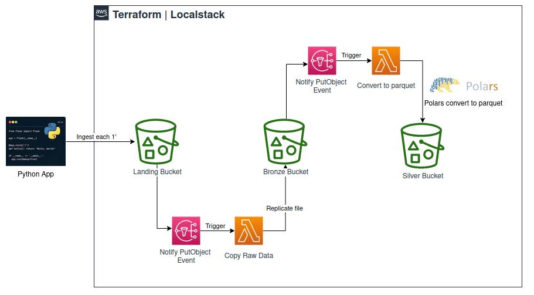

# Localstack Project
## Tflocal - Localstack - AWS Lambda Functions - Polars
## Overview

This demo project demonstrates how we can make use of buckets events to copy objects between buckets and also convert CSV files into parquet format. Steps are as follow:

1. Infrastructure is created using Terraform
2. A python app ingests data (CSV files) every 60 seconds into a bucket
3. A bucket event triggers a lambda function to make a copy of the file into a second bucket
4. Another bucket event triggers a lambda function to convert this file to parquet and save it to another bucket

Buckets 
- `[landing]` Where source CSV files are ingested
- `[bronze]` Where files are replicated
- `[silver]` Where files are finally converted to parquet format
- `[lambdas]` Where zipped source packages required by lambda functions are stored


## Initial Setup
### Installing local required packages
```bash
pipx install terraform-local
```

### Building services 
```bash
# Build custom images
make build

# Start Services
make up

# Stop Services
make down
```

### Generate zip files with required packages by Lambda functions
```bash
make lambda_pkgs
```


### Deploying infrastructure 
```bash
# Init tf 
tflocal init

# Check tf plan
tflocal plan

# Deploy infrastructure defined in main.tf
tflocal apply --auto-approve

# Destroy infrastructure
tflocal destroy
```

### Ingest data into bucket
```bash
# Edit apps/flights-generator/.env if needed
cat apps/flights-generator/.env

# Begin ingesting
make ingest_data
```

### List bucket objects
```bash
# Connect to aws environment CLI container
docker compose run cli-localstack

# List buckets content
aws s3 ls landing
aws s3 ls bronze
aws s3 ls silver
```

## Utils

```bash
# Manually create a lambda function
aws lambda create-function --function-name localstack-lambda-url-example  --runtime python3.10 --zip-file fileb://lambdas/function.zip --handler handler.lambda_handler --role arn:aws:iam::000000000000:role/lambda-role

# Manually invoke lambda function for converting to parquet
# Replace "function-name" and "key" with the right object name
aws lambda invoke --function-name lambda-cp-landing-bronze --cli-binary-format raw-in-base64-out --payload '{ "Records": [ { "s3": { "bucket": { "name": "landing" }, "object": { "key": "flights_9698.csv" } } } ] }' response.json

aws lambda invoke --function-name lambda-convert-parquet --cli-binary-format raw-in-base64-out --payload '{ "Records": [ { "s3": { "bucket": { "name": "bronze" }, "object": { "key": "flights_4131.csv" } } } ] }' response.json

# Check response
cat response.json

# Copy objects
aws s3 cp --recursive s3://bronze/ .

# Connect to data generator container
docker compose run -it -v $(pwd)/apps/flights-generator:/app --entrypoint bash flights_generator
python flights-generator.py 
```
